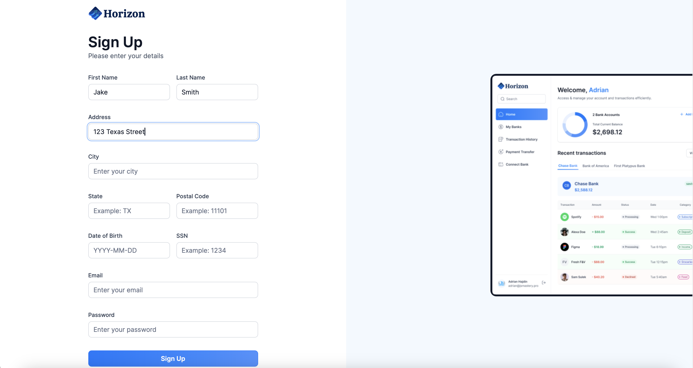
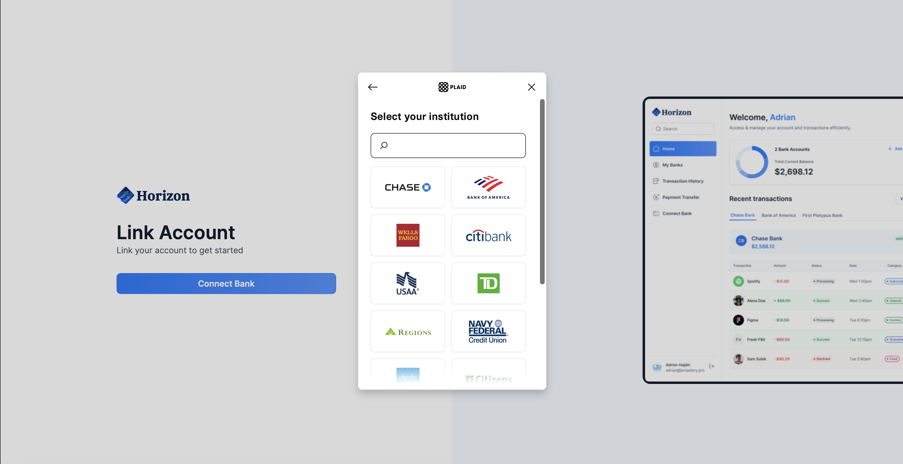
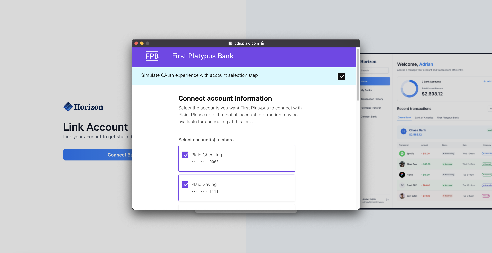
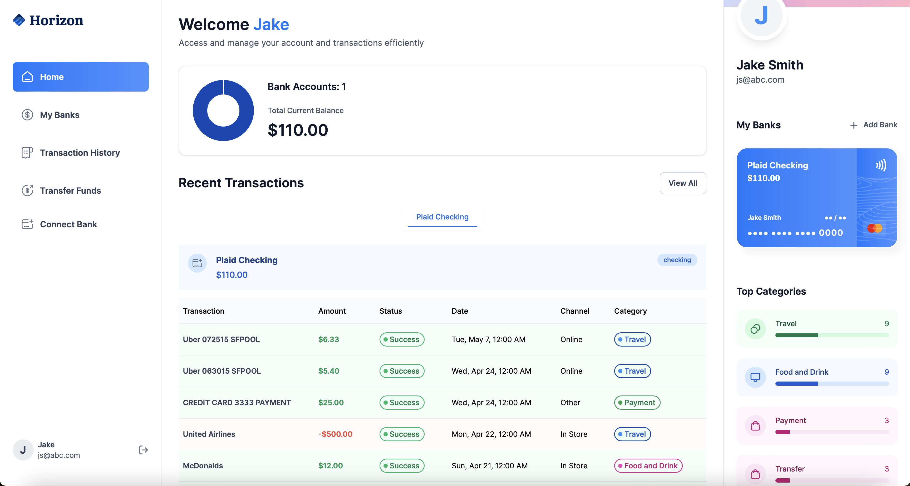
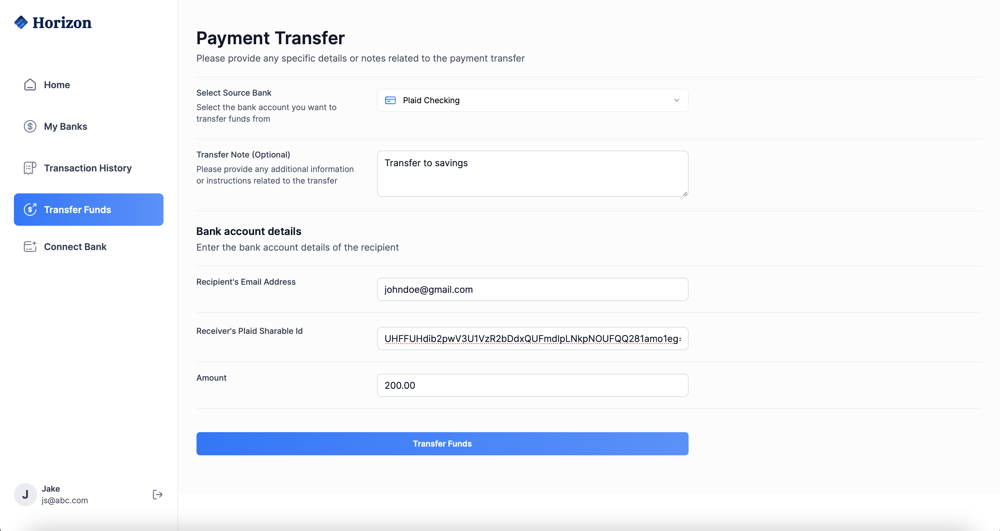

## About this app

Horizon is a banking app that was created with NextJs, Typscript and TailwindCSS. It utilizes Appwrite for its database, Plaid to connect and manage communication between the app and connected accounts as well as Dwolla to process payments.

I also built Sentry into the app which allows for quick debugging as it monitors when the app has failures and can allow me to see a video recording of the user screen (whilst hiding all user info) in order to quickly debug - a very important feature for a banking app.

Many components were built using ShadCN's vast library

### Functionality & Key Features

The site is fully adjustable for screen sizes ranging from mobile to desktop.

I followed a tutorial created by JavaScriptMastery to become more proficient with TypeScript and NextJs, learn more key principles and best practices in order to expand my portfolio.

The Horizon Banking App has been deployed on Vercel can be viewed here:

https://banking-lf1rw5po8-willfranklands-projects.vercel.app/sign-in

## Tech Stack

- NextJs
- TypeScript
- TailwindCSS
- ShadCN
- Appwrite
- Plaid
- Sentry
- Dwolla

## Screenshots

## Available Scripts

In the project directory, you can run:

### `npm  i`
### `npm  run dev`

Runs the app in the development mode.\
Open [http://localhost:3000](http://localhost:3000) to view it in your browser.

The page will reload when you make changes.\